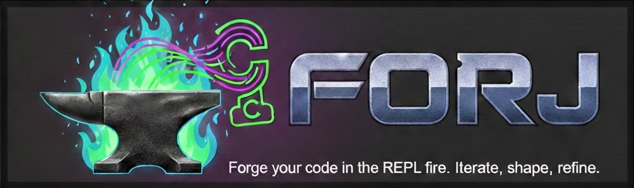

<p align="center">
  
</p>

<h1 align="center">forj</h1>

<p align="center">
  <em>Forge your code in the REPL fire. Iterate, shape, refine.</em>
</p>

REPL-driven LLM development for Clojure. Provides seamless Claude Code integration with automatic project detection, REPL connectivity, and context injection.

## Status

| Component | Status | Description |
|-----------|--------|-------------|
| forj-mcp | ✅ Complete | MCP server with 26 tools |
| forj-hooks | ✅ Complete | SessionStart + UserPromptSubmit + PreToolUse |
| forj-skill | ✅ Complete | `/clj-repl` + `/clj-init` + `/lisa-loop` |

## Prerequisites

- [Babashka](https://babashka.org/) (bb)
- [clojure-mcp-light](https://github.com/bhauman/clojure-mcp-light) - provides `clj-nrepl-eval` for REPL communication

```bash
# Install Babashka
curl -sLO https://raw.githubusercontent.com/babashka/babashka/master/install
chmod +x install && ./install

# Install clojure-mcp-light (provides clj-nrepl-eval)
bbin install io.github.bhauman/clojure-mcp-light
```

## Quick Start

```bash
git clone https://github.com/ATeal/forj.git
cd forj
bb install    # Installs MCP, hooks, and skill to ~/.claude/
```

Then restart Claude Code. The tools will be available automatically in any Clojure project.

## MCP Tools

### Core REPL Tools

| Tool | Description | Like |
|------|-------------|------|
| `repl_eval` | Evaluate Clojure code in nREPL | Direct eval |
| `reload_namespace` | Reload a namespace from file | `,ef` |
| `eval_at` | Evaluate form at specific line (root/inner) | `,er` / `,ee` |
| `eval_comment_block` | Evaluate all forms in a comment block | `,eb` |
| `doc_symbol` | Look up documentation for a symbol | `K` |
| `discover_repls` | Find running nREPL servers | - |
| `repl_snapshot` | Snapshot of loaded namespaces and vars | - |

### Project Tools

| Tool | Description |
|------|-------------|
| `analyze_project` | Get project configuration (tasks, aliases, builds) |
| `run_tests` | Run tests (auto-detects bb/clj/shadow/lein) |
| `validate_project` | Validate project setup (deps, npm, Java version) |
| `scaffold_project` | Create new project from composable modules |
| `view_repl_logs` | View backend/shadow/expo logs |

### Process Management

| Tool | Description |
|------|-------------|
| `track_process` | Track a background process for cleanup |
| `stop_project` | Stop all tracked processes |
| `list_tracked_processes` | List tracked processes |

### Lisa Loop (Autonomous Development)

| Tool | Description |
|------|-------------|
| `lisa_create_plan` | Create LISA_PLAN.edn with checkpoints |
| `lisa_get_plan` | Read current plan and progress |
| `lisa_mark_checkpoint_done` | Mark a checkpoint complete |
| `lisa_run_orchestrator` | Run the autonomous loop |
| `lisa_watch` | Monitor loop progress |
| `validate_changed_files` | Validate changed files via REPL |
| `lisa_run_validation` | Run validation checks (REPL/Chrome/Judge) |
| `lisa_check_gates` | Check checkpoint gates |
| `lisa_append_sign` | Record a learning/failure |
| `lisa_get_signs` | Read learnings from previous iterations |
| `lisa_clear_signs` | Clear signs file |

## Features

### Path-Based REPL Routing
Automatically routes code to the right REPL based on file type:
- `.cljs` → ClojureScript REPL
- `.bb` → Babashka REPL
- `.clj` → Clojure/Babashka REPL (based on project)

### Hooks
- **SessionStart**: Detects Clojure projects, injects context about tasks/aliases/REPLs
- **UserPromptSubmit**: Reminds Claude to use REPL-first workflow
- **PreToolUse**: Auto-fixes Clojure delimiter errors before file writes (via `clj-paren-repair-claude-hook`)

### Skills

| Skill | Description |
|-------|-------------|
| `/clj-repl` | Start or connect to nREPL servers with auto-detection |
| `/clj-init` | Create new Clojure projects with interactive wizard |
| `/lisa-loop` | REPL-driven autonomous development loops |

#### /clj-init Project Types
- **Script/CLI** - Babashka with tasks
- **Library** - deps.edn with tests
- **Web API** - Ring/Reitit backend
- **Full-stack** - Clojure + ClojureScript + shadow-cljs
- **Mobile** - Expo + ClojureScript (Reagent/Re-frame)
- **Flutter** - ClojureDart + Flutter (experimental)

#### /lisa-loop - REPL-Driven Autonomous Loops
Autonomous development loops with REPL validation, inspired by [Ralph Wiggum](https://ghuntley.com/ralph/):

```bash
/lisa-loop "Build a REST API for users" --max-iterations 20
```

**How it works:**
1. You describe the task, Claude proposes checkpoints for approval
2. Creates `LISA_PLAN.edn` with checkpoints and dependency graph
3. Orchestrator spawns fresh Claude instances for each checkpoint
4. Each instance is instructed to use REPL-driven validation
5. Learnings from failures persist in `LISA_SIGNS.md` across iterations
6. Supports parallel execution for independent checkpoints

**Features:**
- **EDN plans** with checkpoint dependencies and acceptance criteria
- **Parallel execution** - independent checkpoints run concurrently
- **Fresh context** per iteration (no context bloat)
- **Signs system** - failures are recorded to prevent repeating mistakes
- **Chrome/Playwright support** for UI checkpoints
- **Auto-commit** - each completed checkpoint creates a git rollback point

## Project Structure

```
forj/
├── bb.edn                    # Root tasks (install, test, etc.)
├── packages/
│   ├── forj-mcp/            # MCP server
│   │   ├── src/forj/mcp/
│   │   └── test/forj/mcp/
│   ├── forj-hooks/          # Claude Code hooks
│   │   ├── src/forj/hooks/
│   │   └── test/forj/hooks/
│   └── forj-skill/          # Skills
│       ├── SKILL.md         # /clj-repl skill
│       ├── clj-init/        # /clj-init skill
│       │   ├── SKILL.md
│       │   └── templates/   # Project templates
│       ├── lisa-loop/       # /lisa-loop skill
│       │   └── SKILL.md
│       └── test/forj/
├── examples/                 # Config templates
└── .claude/
    └── settings.json        # Hook registration
```

## Development

```bash
bb tasks              # List available tasks
bb nrepl              # Start nREPL server on port 1669
bb test               # Run all tests (34 tests, 273 assertions)
bb test:mcp           # Test MCP tools
bb test:hooks         # Test hooks
bb test:skill         # Validate skill definition
bb mcp:dev            # Run MCP server for testing
bb logs               # View forj logs
bb cleanup:sessions   # Remove old session files (>7 days)
bb install            # Install to ~/.claude/
bb uninstall          # Remove from ~/.claude/
```

## Manual Configuration

### MCP Server
Add to `~/.claude/mcp.json`:
```json
{
  "mcpServers": {
    "forj": {
      "command": "bb",
      "args": ["-cp", "/path/to/forj/packages/forj-mcp/src", "-m", "forj.mcp.server"]
    }
  }
}
```

### Hooks
Add to `~/.claude/settings.json`:
```json
{
  "hooks": {
    "SessionStart": [{
      "hooks": [{
        "type": "command",
        "command": "bb -cp /path/to/forj/packages/forj-mcp/src:/path/to/forj/packages/forj-hooks/src -m forj.hooks.session-start"
      }]
    }]
  }
}
```

## Architecture

Built entirely in Babashka for fast startup (~10ms). Uses:
- `clj-nrepl-eval` for nREPL communication
- `edamame` for Clojure parsing with location metadata
- Path-based routing for multi-REPL projects

## License

EPL-2.0
